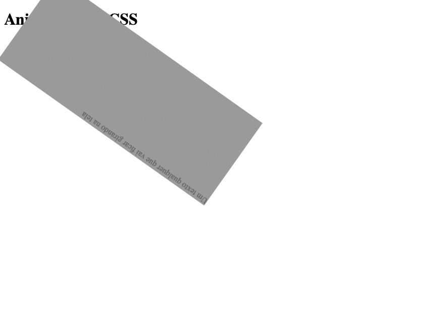

# Animações

Nós podemos aplicar uma animação em um elemento HTML através da propriedade CSS `animation`, como no código a seguir:



```markup
<p class="animate">Um texto qualquer que vai ficar girando na tela</p>
```



```css
.animate {
  animation-name: spin;
  animation-duration: 10s;
  animation-timing-function: linear;
  animation-iteration-count: infinite;
}
```



Repare que neste exemplo há **quatro valores associados** a diferentes propriedades: 

* `spin` é o nome da animação, que será usado para definirmos seus passos posteriormente.
* `10s` é a duração da animação, no caso 10 segundos.
* `linear`  diz que a animação deve ser executada de forma linear, ou seja, sem aceleração ou qualquer tipo de diferença na velocidade dela, sempre constante.
* `infinite` por quanto tempo ela deve se repetir. Neste caso, é para sempre.

Ok, definido o nome da animação, o tempo, velocidade e repetição vamos definir "o que" vai acontecer nessa animação. Aqui é onde entram os **Keyframes**.

### Keyframes

A regra `@keyframes` vai definir as etapas da sua animação. Com ela você vai informar o início e o final do valor da propriedade CSS que você deseja animar. Vale lembrar que **a animação acontece na transição de um valor para o outro**. Exemplo: na transição de 100px de width para 200px de width. Ou na transição do `background-color` de `black` para `white` \(no caso de cores\).

Não tem mistério para declararmos ela. Basta usar o nome da animação \(nesse caso, `spin`, mas poderia ter sido qualquer uma\) e definir as etapas da mesma. No exemplo abaixo usamos uma propriedade `transform`. Veja mais [aqui](https://medium.com/@eduagni/css3-transform-e-transition-af86fe5dca4b). 

```css
@keyframes spin {
  0% {
    transform: rotateZ(0deg);
    background-color: black;
    color: white;
  }

  100% {
    transform: rotateZ(360deg);
    background-color: white;
    color: black;
  }
}
```

O resultado é algo semelhante a animação abaixo.



### Propriedades das animações <a id="d7ad"></a>

No exemplo definimos a nossa animação utilizando a versão "enxuta" da declaração. Se quisermos descrever melhor cada um dos itens, podemos definir as propriedades uma a uma:

* **animation-name:** O nome da animação.
* **animation-duration:** Por quanto tempo a animação deve durar \(em segundos\).
* **animation-timing-function:** Afunção de temporização usada pela animação \(valores comuns: linear, ease\). Padrão: ease.
* **animation-delay:** Tempo que a animação deve esperar para começar
* **animation-iteration-count:** O número de vezes que a animação deve ser executada. Espera um número inteiro ou a palavra `infinite`.
* **animation-direction:** A direção da animação. Pode ser `normal` , `reverse` , `alternate` ou `alternate-reverse`.
* **animation-fill-mode :** Como estilizar o elemento quando a animação termina, depois de terminar seu número de contagem de iteração.
* **animation-play-state:** Se setado como `paused` , pausa a animação.

### Mais sobre animações

Poderiamos falar muito sobre animações em CSS, mas cada animação vai requerer códigos específicos e entendimento específico de funções de transformação e transição. O exemplo aqui serve para demonstrar como é a estrutura base para animações e lhe permite avançar no entendimento e criação de novas animações de acordo com sua necessidade.

Veja também alguns exemplos e gere suas próprias animações no [Animista](https://animista.net/).

