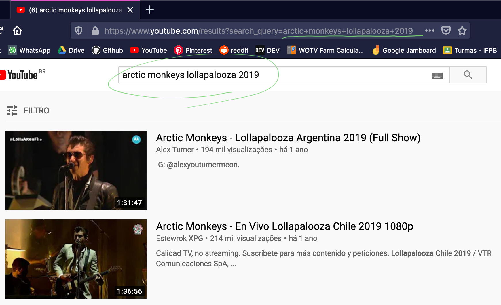
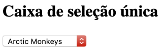
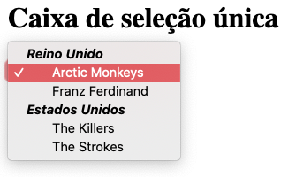
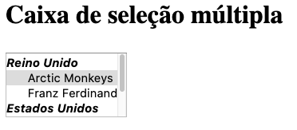

# Formulários

Formulários HTML são um dos principais pontos de **interação entre um usuário e um web site ou aplicativo**. Eles permitem que os usuários enviem dados para um website e que ele realize algum processamento com eles. Na maior parte do tempo, os dados são enviados para um **servidor** da web.

Um formulário HTML é feito de um ou mais **componentes**. Podem ser **campos de texto** (de linha única ou de várias linhas), caixas de seleção, botões e etc. A maior parte do tempo, estes elementos são emparelhados com uma legenda que descreve o seu objetivo dentro de um formulário.


Nesse conteúdo, traduzi quando foi possível e deixei o **termo em inglês** para que ao pesquisar sobre para expandir seu conhecimento você não tenha problemas em achar artigos relacionados.


Todo formulário começa com a tag `<form>` e encerra com `</form>`. Ao utilizar essa tag, o atributo `action` é **obrigatório**. Esse atributo informa **o local** **para onde** esse formulário deve ser enviado. Observe o exemplo de código abaixo e o resultado visual dele, ou se preferir, no [Codesandbox](https://codesandbox.io/s/071-formularios-v225h).

```markup
<h1>Formulários em HTML</h1>
<form action="https://algumaurl.com" method="post">
  <div>
    <label for="nome">Nome:</label>
    <input name="nome" type="text" />
  </div>
  <div>
    <label for="email">E-mail:</label>
    <input name="email" type="email" />
  </div>
  <div>
    <label for="msg">Mensagem:</label>
    <textarea name="mensagem"></textarea>
  </div>
  <button type="submit">Enviar formulário</button>
</form>
```

.png>)

### Tag \<form>

O atributo `action` informa que estamos submetendo tudo que for preenchido nesse formulário para o endereço que é passado como valor (nesse caso, um endereço do Formspree, adiante será explicado o porquê).

Além disso, ele tem outro atributo chamado `method`, que indica o valor **POST**. Existem dois tipos de métodos para enviar formulários, **GET** e **POST**. Abaixo a explicação de cada um deles:

* O **GET** passa variáveis por URL, é útil para você compartilhar uma página de um produto, uma busca em um site ou um endereço de uma rede social. Quando solicitamos um endereço pra um navegador, ele realiza uma operação do tipo **GET**. Veja a imagem abaixo, onde ao digitar os termos de busca e clicar na lupa, o endereço do navegador **exibe** o que estava no formulário dentro da URL.



* Com **POST** você não pode fazer essas coisas citadas acima, pois os dados são enviados no corpo da requisição **HTTP**. É ideal para **formulários de login**, **cadastros** e envio de arquivos, que não é possível com **GET**.

**Resumindo**: a diferença está principalmente na **visibilidade dos dados**. Outros detalhes sobre esses dois métodos e outros, serão vistos em momentos apropriados, para que o entendimento não fique complicado agora.


Agora que você identificou o que é o atributo **action**, qual seria o valor no caso da página do Youtube mostrada acima?



Utilizamos um endereço do site **formspree.io** porque assim **não precisamos implementar todo o código necessário para enviar um email**. Isso porque se trata de um formulário simples, para casos mais complexos, precisariamos implementar toda a lógica no servidor que irá receber esses dados. Mas isso fica para outro semestre


### Componentes de formulário

Muitos dos elementos usados para definir widgets de formulário têm seus próprios atributos. Entretanto, há um conjunto de atributos comuns a todos os elementos do formulário, os quais permitem certo controle sobre os widgets. Uma lista desses atributos comuns pode ser encontrado abaixo:

| Nome do atributo | Valor padrão | Descrição                                                                                                                                           |
| ---------------- | ------------ | --------------------------------------------------------------------------------------------------------------------------------------------------- |
| `autofocus`      | (falso)      | Este é um atributo booleano (verdadeiro ou falso) que permite especificar automaticamente qual elemento deverá ter o foco quando a página carregar. |
| `disabled`       | (_falso_)    | Este é um atributo booleano que indica que o usuário não pode interagir com este elemento.                                                          |
| `name`           |              | O nome do elemento. Este atributo é enviado com os dados do formulário. Não é **obrigatório**, mas é **recomendado**.                               |
| `value`          |              | O Valor inicial do elemento.                                                                                                                        |

Como você deve ter percebido no exemplo, todos os campos do formulário estão, cada um, dentro de elementos `<div>` e cada um contem também um elemento `<label>` que os acompanha. Encare a `div` como uma divisão sem significado, por hora. Já o `label` representa uma legenda para um **item em uma interface de usuário**.

### Componentes de texto

#### Campos de entrada de uma só linha

Os componentes criados com a tag `<input>` são amplamente utilizados por terem flexibilidade para vários tipos de dados, de texto até data e hora, com validações próprias para cada tipo.


Os componentes para entrada de texto só aceitam textos simples, sem formatações do tipo negrito, itálico, etc.


Um componente de entrada de texto (**Input Text**) em uma linha única é feita com `<input`` `**`type="text"`**`>`. Veja o exemplo de código abaixo ou ele em execução [aqui](https://codesandbox.io/s/07-formularios-v225h). Uma vez que esses campos só aceitam textos de uma linha, qualquer texto que seja colado e tenha mais linhas, terá suas quebras de linhas removidas.

```markup
<input type="text" name="comentario">
```

Existem outros valores para o atributo `type` que mantem o estilo de entrada de texto de uma linha, mas que garantem validação de tipos de dados. Crie um exemplo de formulário e teste os seguintes tipos:

* `email`
* `date`
* `tel`
* `url`
* `search`
* `password`

#### Campos de entrada de várias linha

Para o caso de necessitar de várias linhas, incluindo suas quebras quando for o caso, usamos a tag `<textarea>`. Além dos atributos indicados anteriormente, essa tag tem os atributos `col`, que indica quantas colunas visíveis o componente deve ter e `row` que indica quantas linhas visíveis o componente deve ter.

```markup
<textarea name="mensagem" cols="30" rows="10"></textarea>
```

Perceba que, diferentemente de `<input>`, aqui precisamos usar a tag de abertura e de fechamento.

### Componentes _drop-down_

Componentes drop-down são uma maneira simples de permitir que o usuário selecione uma dentre muitas opções sem tomar muito espaço da interface com o usuário. Veja os exemplos abaixo no [Codesandbox](https://codesandbox.io/s/072-componentes-drop-down-toib9?file=/index.html) para um melhor entendimento.

#### Caixa de seleção simples

Uma caixa de seleção (**Select Box**) é criada a partir da tag `<select>` com um ou mais elementos da tag `<option>` dentro dela, cada um especificando um dos possíveis valores. Veja o exemplo abaixo.

```markup
<select name="simples">
  <option>Arctic Monkeys</option>
  <option>The Killers</option>
  <option>Cage the Elephant</option>
</select>
```



Caso necessário, o valor padrão para uma caixa de seleção pode ser definido usando o atributo `selected` na opção desejada, para que seja **pré-selecionada quando a página carregar**. Além disso, é possível organizar as opções dentro de subgrupos, utilizando a tag `<optgroup>`, como no exemplo abaixo.

```markup
<h1>Selecione uma banda</h1>
<select name="simples">
  <optgroup label="Reino Unido">
    <option selected>Arctic Monkeys</option>
    <option>Franz Ferdinand</option>
  </optgroup>
  <optgroup label="Estados Unidos">
    <option>The Killers</option>
    <option>The Strokes</option>
  </optgroup>
</select>
```



#### Caixa de seleção múltipla

Por padrão, uma caixa de seleção deixa o usuário escolher apenas um dos valores dentre as opções. Adicionando o atribute `multiple` na tag `<select>` permite que o usuário seleciona várias das opções, ou até todas, bastando apenas segurar a tecla `Ctrl` ou `Command` enquanto isso.

```markup
<h1>Selecione várias bandas</h1>
<select name="simples">
  <optgroup label="Reino Unido">
    <option selected>Arctic Monkeys</option>
    <option>Franz Ferdinand</option>
  </optgroup>
  <optgroup label="Estados Unidos">
    <option>The Killers</option>
    <option>The Strokes</option>
  </optgroup>
</select>
```



### Componentes "checáveis"

Componentes checáveis são aqueles em que o estado pode ser mudado ao clicar neles. Existem dois tipos em HTML: **Checkbox** e **Radio Button** (as traduções não ajudaram nesse caso, prefira usar esses termos).

Para aumentar a usabilidade/acessibilidade do usuário, nesses tipos de componentes, usaremos a tag `<fieldset>` juntamente com a tag `<legend>` para prover uma descrição dos itens que são **relacionados**.

#### Checkbox

Componentes checáveis do tipo Check Box são criados a partir da tag `<input>` igual a que utilizamos anteriormente, tendo seu valor de `type` definido para checkbox. Veja o exemplo abaixo e o resultado visual. Perceba também que usamos [Listas](listas.md) para organizar melhor os itens que podemos checar ou não.

```markup
<fieldset>
  <legend>Selecione todas as bandas que você gosta</legend>
  <ul>
    <li>
      <label for="am">Arctic Monkeys</label>
      <input type="checkbox" name="am" value="am" />
    </li>
    <li>
      <label for="the-killers">The Killers</label>
      <input type="checkbox" name="the-killers" value="the-killers" />
    </li>
    <li>
      <label for="franz-ferdinand">Franz Ferdinand</label>
      <input
        type="checkbox"
        name="franz-ferdinand"
        value="franz-ferdinand"
      />
    </li>
    <li>
      <label for="bloc-party">Bloc Party</label>
      <input type="checkbox" name="bloc-party" value="bloc-party" />
    </li>
    <li>
      <label for="bleachers">Bleachers</label>
      <input type="checkbox" name="bleachers" value="bleachers" />
    </li>
  </ul>
</fieldset>
```

.png>)

Nesse caso, vários itens podem ser selecionados ao mesmo tempo. É o comportamento esperado para esse tipo de componente.

#### Radio Button

Já os componentes do tipo **Radio Button** são mais usados para seleção de apenas **1 opção**. Para que isso aconteça, todos eles devem ter o mesmo valor no atributo `name` para que o navegador entenda que fazem parte do mesmo grupo. Veja o exemplo abaixo e o resultado visual.

```markup
<fieldset>
  <legend>Selecione a banda que você mais gosta</legend>
  <ul>
    <li>
      <label for="am">Arctic Monkeys</label>
      <input type="radio" name="banda" value="am" />
    </li>
    <li>
      <label for="the-killers">The Killers</label>
      <input type="radio" name="banda" value="the-killers" />
    </li>
    <li>
      <label for="franz-ferdinand">Franz Ferdinand</label>
      <input type="radio" name="banda" value="franz-ferdinand" />
    </li>
    <li>
      <label for="bloc-party">Bloc Party</label>
      <input type="radio" name="banda" value="bloc-party" />
    </li>
    <li>
      <label for="bleachers">Bleachers</label>
      <input type="radio" name="banda" value="bleachers" />
    </li>
  </ul>
</fieldset>
```

.png>)

### Botões

Em HTML temos 3 (três) tipos de botões possíveis:

* **Submit**, que envia os dados do formulário para o que está definido em `action`.
* **Reset**, que limpa os dados do formulário, deixando todos os componentes em seu estado padrão.
* **Anônimo**, que é um botão sem efeitos, mas que dá espaço para que alguma ação seja feita via _Javascript_.

Um botão é criado usando a tag `<button>` ou um elemento `<input>`. O valor de `type`, em ambos os casos, é que determina qual tipo de botão será mostrado. Veja os exemplos abaixo e perceba como eles são mostrados visualmente [aqui](https://codesandbox.io/s/074-botoes-327z9).

```markup
<button type="submit">
    Submeter o formulário
</button>

<input type="submit" value="Submeter o formulário">
```

```markup
<button type="reset">
    Resetar o formulário
</button>

<input type="reset" value="Resetar o formulário">
```

```markup
<button type="button">
    Botão anônimo
</button>

<input type="button" value="Botão anônimo">
```

### Considerações finais

O que foi exibido aqui é apenas uma pequena porção do que pode ser feito com formulários em HTML. Existem formulários que requerem componentes mais ricos em termos de experiência e facilidade de preenchimento, mas esses tópicos estão fora do escopo da disciplina. Mesmo assim, sintam-se a vontade para comentar e perguntar durante as aulas.

Para completar o requisito da página de contato no projeto final da disciplina, tudo que foi mostrado aqui já é suficiente. Crie uma conta no **Formspree** e configure um formulário para seu próprio email e faça os testes. As questões estéticas dos formulários serão vistos no segundo módulo da disciplina, quando falaremos de CSS
