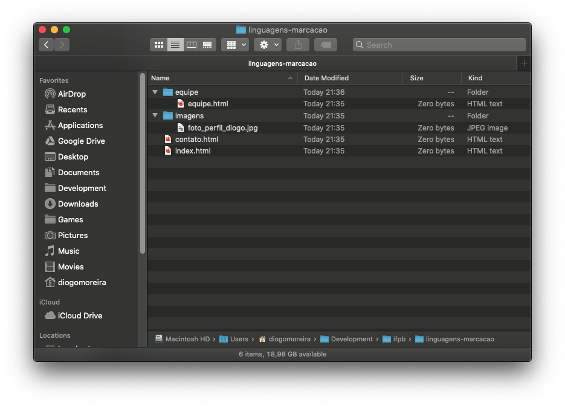

# URLs

Para entender completamente hyperlinks, é preciso entender URLs e caminhos de arquivos dentro de um sistema operacional. Um **URL** é uma sequência de texto que define **onde** algo está localizado na web. Por exemplo, a página inicial do IFPB em `https://www.ifpb.edu.br`.

Os URLs usam **caminhos** para encontrar arquivos. Os caminhos especificam onde, no explorador de arquivos, o recurso que você está interessado está localizado. Vejamos um exemplo simples de uma **estrutura de diretório**.


As estruturas que iremos comentar aqui também existem no **Codesandbox**. Em caso de dúvida, poste no Classroom.




A raiz dessa estrutura de diretório é o diretório que chamamos de `linguagens-marcacao`. Ao trabalhar localmente com um site, você terá um diretório no qual **ele todo esta dentro**. Incluído na raiz, temos um arquivo `index.html` e um arquivo `contato.html`. Em um site real, `index.html` seria nossa **página inicial** ou página de entrada \(uma página da web que serve como ponto de entrada para um site ou uma seção específica de um site\).

Existem também dois diretórios dentro da nossa raiz — `equipe` e `imagens`. Neles, temos um arquivo `equipe.html` e `foto_perfil_diogo.jpg`, respectivamente. Seria possível, felizmente, ter dois arquivos `index.html` em um projeto, caso quisessemos mudar o nome de `equipe.html`, desde que estejam em **locais diferentes no sistema de arquivos**. Muitos sites fazem isso.

A seguir vamos mostrar como criar hyperlinks para destinos diferentes na estrutura de diretórios que vimos anteriormente.

**Mesmo diretório:** se você deseja incluir um hiperlink dentro de `index.html` apontando para `contato.html`, basta especificar o nome do arquivo ao qual deseja vincular, já que está **no mesmo diretório que o arquivo atual**. Portanto, o URL que você usaria seria `contato.html`:

```markup
<p>Visite a nossa <a href="contato.html">página de contatos</a>.</p>
```

**Movendo-se para baixo em subdiretórios:** se você quisesse incluir um hiperlink dentro do `index.html` apontando para o `equipe/equipe.html`, você precisaria "descer" no diretório de projetos antes de indicar o arquivo que deseja vincular. Isso é feito especificando o nome do diretório, depois uma barra e, em seguida, o nome do arquivo. Então o URL que você usaria seria `equipe/equipe.html`:

```markup
<p>Conheça nossa <a href="equipe/equipe.html">equipe</a>.</p>
```

**Movendo-se de volta para os diretórios pai:** se você quisesse incluir uma hiperlink dentro de `equipe/equipe.html` apontando para a imagem que está no outro diretório `imagens/foto_perfil_diogo.jpg`, você precisaria: \(**1**\) "Subir" um nível de diretório e \(**2**\) "Voltar" para o diretório `imagens`. "Subir um diretório" é indicado usando dois pontos — `..` — então a URL que você usaria seria  `../imagens/foto_perfil_diogo.jpg`

```markup
<p>Um link para uma foto <a href="../imagens/foto_perfil_diogo.jpg">minha</a>.</p>
```

**Nota**: Você pode combinar várias "instâncias" desses recursos de subir ou descer em diretórios em URLs complexas, se necessário, por exemplo`../../../caminho/complexto/para/arquivo.html`. Porém, a recomendação é tentar manter tudo de maneira simples.

A maneira de referenciar **URLs** que vimos aqui serve para todas as vezes que falarmos de URL daqui pra frente, se tiver em dúvidas volte a esse documento sempre que precisar.

